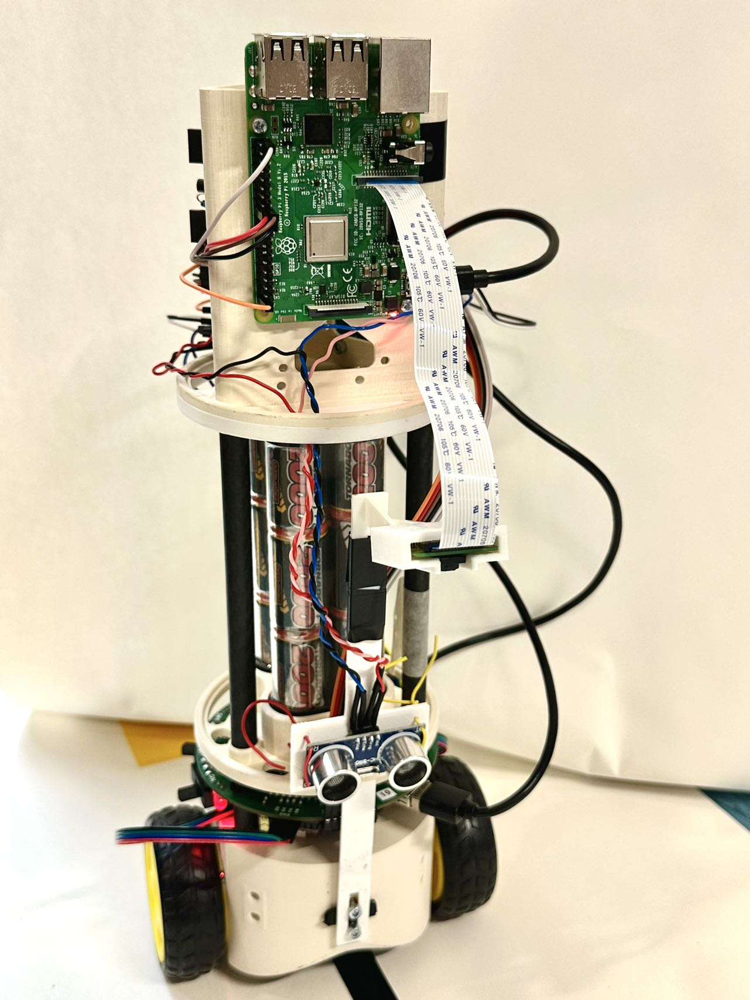

# chady-Balance-Robot



## Introduction
This two-wheeled service robot is capable of running through unsupervised hotel corridors and delivering food and other items directly to target guests’ rooms. The robot tracks the black line on the floor and uses the camera to detect the room door. Once it reaches the door, the buzzer plays a beat to inform the guests that the service has arrived. An ultrasonic collision avoidance unit allows the robot to detect obstacles and stop to prevent collisions. A Web interface has been implemented to monitor the robot’s dynamic status, battery status, and real-time power consumption. Additionally, the Web interface allows human workers to manually control the robot when needed.

## Installation
The setup instruction is included in the 'documents' folder. Please refer to the [setup.md](documents/setup.md) file for detailed steps on how to set up the project.

## Project Folder Structure

```plaintext
project-root/
├── esp32/
│   ├── src/
|   |   ├── config.h       # Global variables and setup
|   |   ├── internet.h     # Internet functions 
|   |   ├── pid.h          # PID control functions
|   |   ├── step.h         # Stepper motor functions
|   |   ├── utils.h        # Utility functions
│   │   └── main.cpp       # Main loop
│   └── platformio.ini     # PlatformIO configuration file
├── raspi/
│   ├── all.py             # File running on Raspberry Pi
│   └── requirements.txt   # Python dependencies for Raspberry Pi
├── server/
│   ├── app.py             # File running on the server
│   └── requirements.txt   # Python dependencies for the server
├── frontend/
│   ├── node_modules/      # Directory for installed Node.js modules
│   ├── public/
│   │   └── index.html     # Main HTML file
│   ├── src/
│   │   ├── App.js         # Main React component for running
│   │   ├── index.css      
│   │   ├── index.js       
│   │   ├── Logo.png      
│   ├── package-lock.json  # npm lock file
│   └── package.json       # npm configuration file for installing
├── sample_code/           # indepent parts for each function
│   ├── power/
│   └── camera/
│   └── buzzer/
├── esp32 for web testing  # testing tool for esp32
├── documents/             # setup instruction
│   ├── setup.md
│   └── robot.jpg
├── README.md                     
```
